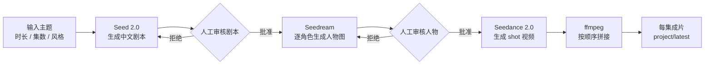

# Shortdrama Pipeline

中文 | [English](README.en.md)

[](https://github.com/drasstry/shortdrama-pipeline/actions/workflows/ci.yml)


**Shortdrama Pipeline** 是一个面向中文短剧生产的后端自动化流水线。输入一个主题，它会帮你生成中文剧本、主体人物形象、分镜视频，并把视频片段拼接成单集成片。

它不是一个大而全的平台，而是一条能跑起来、能审核、能续生产、能接真实模型的最小可用链路。你可以先用 CLI 在本地验证，再逐步接 Web 前端、审核台或内部生产系统。

## 一眼看懂



核心原则很简单：**剧本确认后才生成人物，人物确认后才生成视频。** 这样可以避免在错误剧本或错误人物上浪费昂贵的视频额度。

## 适合谁

- 想快速验证 AI 短剧生产链路的开发者。
- 想批量尝试中文短剧题材、人设和反转钩子的内容团队。
- 想把 Seed / Seedream / Seedance 串成稳定后端流程的工程团队。
- 想先用 CLI 和 API 跑通后端，再慢慢做前端界面的产品团队。

## 现在能做什么

- **中文剧本生成**：调用 Seed 2.0 生成剧名、人设、分集剧情和 shot 分镜。
- **脚本质检**：生成 warning-only 的脚本质量报告，提示 shot 时长、动作过载、对白过载等问题。
- **人工审核门槛**：剧本和人物图都有明确审核状态，不会自动越过关键节点。
- **人物图生成**：Seedream 一次生成一个角色，适配“主体人物一致性”的生产需求。
- **视频生成和拼接**：Seedance 2.0 按 shot 生成视频，ffmpeg 按 `shot_order` 拼接成片。
- **项目续生产**：同一项目可沿用最近一次已批准的剧本和人物形象继续生成。
- **fake 模式**：没有 API Key 也能跑完整状态机、CLI、Artifact 和测试。

## 5 分钟跑起来

下面是一条从零开始的本地路径，适合第一次接触这个项目的人。

### 1. 准备环境

你需要：

- Git
- Python 3.11 或更高版本
- ffmpeg，真实视频拼接时需要

macOS 可以这样安装依赖：

```bash
brew install git python ffmpeg
```

如果你已经有 Git、Python 和 ffmpeg，可以跳过这一步。

### 2. 下载代码

```bash
git clone https://github.com/drasstry/shortdrama-pipeline.git
cd shortdrama-pipeline
```

### 3. 创建 Python 虚拟环境

```bash
PYTHON_BIN=$(command -v python3.13 || command -v python3.12 || command -v python3.11 || command -v python3)
$PYTHON_BIN -c 'import sys; assert sys.version_info >= (3, 11), "需要 Python 3.11 或更高版本"'
$PYTHON_BIN -m venv .venv
source .venv/bin/activate
```

看到终端前面出现 `(.venv)`，说明虚拟环境已经启用。如果这里提示 Python 版本不够，macOS 用户可以先运行 `brew install python`，再重新执行上面的命令。

### 4. 安装项目

```bash
pip install -e ".[dev]"
```

安装完成后，确认 CLI 可用：

```bash
shortdrama --help
```

### 5. 进入交互菜单

```bash
shortdrama shell
```

然后按菜单操作：

1. 选择 `创建新项目/新任务`
2. 输入短剧主题、时长、集数
3. 查看生成的剧本
4. 批准剧本
5. 查看人物图
6. 批准人物
7. 等待视频生成和拼接

第一次建议先不配置 API Key，让系统使用 fake 模式跑通流程。fake 模式不会调用线上模型，也不会消耗额度。

## 跑真实模型

如果你要调用火山方舟的真实模型，复制配置模板：

```bash
cp .env.example .env
```

编辑 `.env`：

```env
ARK_API_KEY=你的火山方舟密钥
SHORTDRAMA_PROVIDER_MODE=ark
SHORTDRAMA_OUTPUT_DIR=outputs
SHORTDRAMA_DB_PATH=outputs/shortdrama.sqlite3
ARK_BASE_URL=https://ark.cn-beijing.volces.com/api/v3
```

先跑一个低成本连通性测试：

```bash
shortdrama smoke-ark
```

通过后再进入真实生产：

```bash
shortdrama shell
```

## 常用命令

如果你喜欢直接敲命令，可以不用交互菜单。

```bash
# 创建任务
shortdrama create

# 查看项目和任务
shortdrama projects
shortdrama jobs
shortdrama status <job_id>
shortdrama project-dashboard <project_id>
shortdrama project-latest <project_id>

# 审核剧本
shortdrama review <job_id>
shortdrama approve-script <job_id>
shortdrama reject-script <job_id> --reason "反转不够强"
shortdrama regenerate-script <job_id> --notes "女主更强势，前三秒更抓人"

# 审核人物
shortdrama approve-characters <job_id>
shortdrama reject-characters <job_id> --reason "人物辨识度不够"
shortdrama regenerate-character <job_id> <character_id>

# 基于已有项目继续生产
shortdrama continue-project <project_id> --notes "沿用已批准剧本和人物"

# 失败任务处理
shortdrama failed-summary <job_id>
shortdrama retry-failed <job_id>
shortdrama cleanup-failed <job_id>
```

## 项目状态

你可以用 `shortdrama project-dashboard <project_id>` 查看项目当前走到哪一步。

常见阶段：

- 剧本生成中
- 剧本待审核
- 剧本已批准
- 人物生成中
- 人物待审核
- 人物已批准
- 视频生成中
- 已完成

只有已经批准的剧本和人物会沉淀到 `project/latest`，后续 `continue-project` 也只会复用这些已确认资产。

## 输出在哪里

默认输出目录是 `outputs/`：

```text
outputs/
  projects/
    <project_id>/
      latest/
        script/
        characters/
        videos/
      runs/
        <job_id>/
          input.json
          status.json
          script/
          characters/
          shots/
          videos/
          harness/
          logs/
```

`outputs/` 不会提交到 git，因为里面可能有模型输出、日志、SQLite 数据库和视频文件。

## API 模式

除了 CLI，这个项目也提供 FastAPI 服务，方便后续接前端或外部调度系统。

```bash
shortdrama-api
```

创建任务示例：

```bash
curl -X POST http://127.0.0.1:8000/jobs \
  -H "Content-Type: application/json" \
  -d '{"topic":"替嫁新娘逆袭","duration_seconds":60,"episode_count":1}'
```

## 配置项

常用环境变量：

```env
ARK_API_KEY=你的火山方舟密钥
SHORTDRAMA_PROVIDER_MODE=auto
SHORTDRAMA_OUTPUT_DIR=outputs
SHORTDRAMA_DB_PATH=outputs/shortdrama.sqlite3
ARK_BASE_URL=https://ark.cn-beijing.volces.com/api/v3
SHORTDRAMA_SEEDANCE_CONCURRENCY=2
SHORTDRAMA_SEEDANCE_POLL_INTERVAL_SECONDS=15
SHORTDRAMA_SEEDANCE_MAX_WAIT_SECONDS=1800
```

`SHORTDRAMA_PROVIDER_MODE` 支持：

- `auto`：有 `ARK_API_KEY` 时使用线上 Ark，否则使用 fake provider。
- `ark`：强制使用线上 Ark，缺少 Key 会直接报错。
- `fake`：强制使用本地 fake provider。

## 开发和测试

```bash
source .venv/bin/activate
PYTEST_DISABLE_PLUGIN_AUTOLOAD=1 pytest -q
python -m compileall src/shortdrama_pipeline
```

测试默认使用 fake provider，不会调用线上模型。

## 安全提醒

不要提交真实 API Key。真实密钥只放在本地 `.env`，仓库只提交 `.env.example`。

如果真实 Key 曾经出现在聊天、截图、日志、commit、issue 或 PR 中，请立即到火山方舟后台轮换密钥。

更多说明见 [SECURITY.md](SECURITY.md)。

## 文档

- 架构说明：[中文](docs/ARCHITECTURE.md) / [English](docs/ARCHITECTURE.en.md)
- GitHub 发布指南：[中文](docs/GITHUB_UPLOAD.md) / [English](docs/GITHUB_UPLOAD.en.md)
- 安全说明：[SECURITY.md](SECURITY.md)

## 当前边界

这个项目优先解决后端自动化链路，还不是完整 SaaS 平台。当前不包含：

- 多用户权限
- Web 可视化编辑器
- 云端对象存储集成
- 支付和额度管理
- 视频时间线编辑器

这些能力可以在后端状态机稳定后继续扩展。
